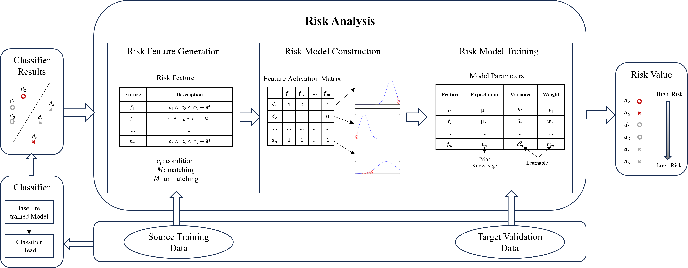

# **[TransferLearningForTextClassificationViaModelRiskAnalysis](https://github.com/syjcomputer/RMTransfer)**

This project is the code for fine-tuning pre-trained NLP models via RiskAnalysis on small samples, mainly focused on news classification. In this project, we take Bert as an example, you can use other nlp models.

The base frame of RiskAnalysis as follows：



The comparison results with other models are as follows:

|           | 20News-AgNews | AgNews-20News | AgNews-BBC | BBC-AgNews | BBC-20News | 20News-BBC |
| --------- | ------------- | ------------- | ---------- | ---------- | ---------- | ---------- |
| Bert      | 91.2          | 83.1          | 89.48      | 78.92      | 62.68      | 88.75      |
| Roberta   | 77.38         | 79.47         | 65.87      | 75.06      | 54.20      | 61.8       |
| XLnet     | 82.87         | 86.23         | 82.77      | 63.05      | 58.87      | 81.06      |
| TextCNN   | 43.78         | 61.05         | 64.39      | 41.23      | 54.64      | 38.79      |
| BertGCN   | 36.06         | 54.97         | 35.36      | 36.38      | 52.4       | 40.04      |
| BERT+CAT  | 31.2          | 50.39         | 36.42      | 35.61      | 30.7       | 44.5       |
| npc-gzip  | 43.51         | 79.05         | 59.22      | 32.24      | 54.76      | 46.45      |
| BERT+UST  | 90.96         | 83.4          | 92.12      | 73.13      | 69.26      | 70.93      |
| NSP       | 81.94         | 85.87         | 77.64      | 75.79      | **70.13**  | 91.69      |
| LearnRisk | **92.11**     | **86.32**     | **93.92**  | **78.94**  | 68.19      | **93.22**  |


## Installation
### Requirement
```
python==3.7
torch==1.8.0+cu11
tensorflow-gpu==2.2.2
keras==2.3.1
bert4keras==0.11.4
numpy==1.18.5
scikit-learn==1.0.2
```

## Quick Start

### Data Prepare
The origin dataset need to be prepared in the folder named**PrepareRiskDataset/{source_dataset}_bert/1.0** as follows:
```
AgNews_bert
 |-1.0- |-train.json # dataset from source dataset
 |      |-val.json  # dataset from target dataset
 |      |-test.json # dataset from source dataset
 |
 |-class.txt # class nums, each line represent a class
```
The json file must include **'text'** and **'label'** for each document.

### Usage
You should execute program in order as follows:
```
PrepareRiskDataset

OneSideDecisionTree

RiskAnalysis
```
We prepare readme.md for each part in each project folder.
## Citations
If you find this repo or our work useful for your research, please consider citing the paper
```bibtex

```

